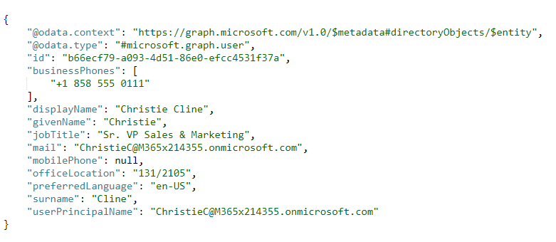
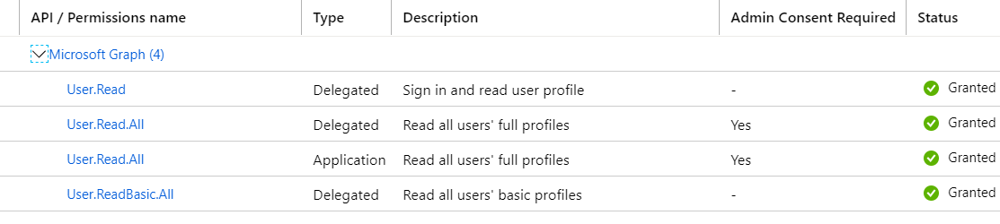

# Pyth_Auth
Demo for python console app (browserless) using MSAL Authentication. Based on [Python sample for Microsoft Graph](https://github.com/microsoftgraph/python-sample-console-app).

## Pre-requisites
* [Office 365 for business account](https://docs.microsoft.com/en-us/previous-versions/office/office-365-api/?redirectedfrom=MSDN#bk_Office365Account)
* [Azure Free Account](https://azure.microsoft.com/en-us/free/free-account-faq/)
* [Python 3.6 or later](https://www.python.org/)

## Installation 

1. Install prerequisite python packages:
`pip install -r requirements.txt`

2. Register an application in Azure portal. 
* Select *API permissions* `Users.Read.All` and `Users.Readbasic.All`. 
3. Edit Authentication settings. 
* Go to *Authentication*. Check the box next to `https://login.microsoftonline.com/common/oauth2/nativeclient`
* Find *Default client type* and set it to `yes`
4. Modify `config.py`
* Replace `'ENTER_YOUR_CLIENT_ID'` with your *Application (client) ID*
* Replace `'ENTER_YOUR_EMAIL_ADDRESS'` with your *Office 365* email address
* Replace `'ENTER_YOUR_PASSWORD'` with your *Office 365* password

## Running the sample
1. Run the command `python sample.py` in your terminal
2. Enter the email address of the person you want to search for in your organisation
3. A Microsoft Graph query will be excecute to return a json object of a manager's email.

e.g. 
* The query exexcuted in the backend: `https://graph.microsoft.com/v1.0/users/MiriamG@M365x214355.onmicrosoft.com/manager`
* Terminal output:

  

## Troubleshooting  
If you are seeing the `Authorization_RequestDenied: Insufficient privelleges to complete the operation.` error, contact your administrator and request admin consent for `Users.Read.All` and `Users.Readbasic.All` permissions.

In your azure portal, under Home > App Registraions > API Permissions, the permissions should look as follows: 

  

